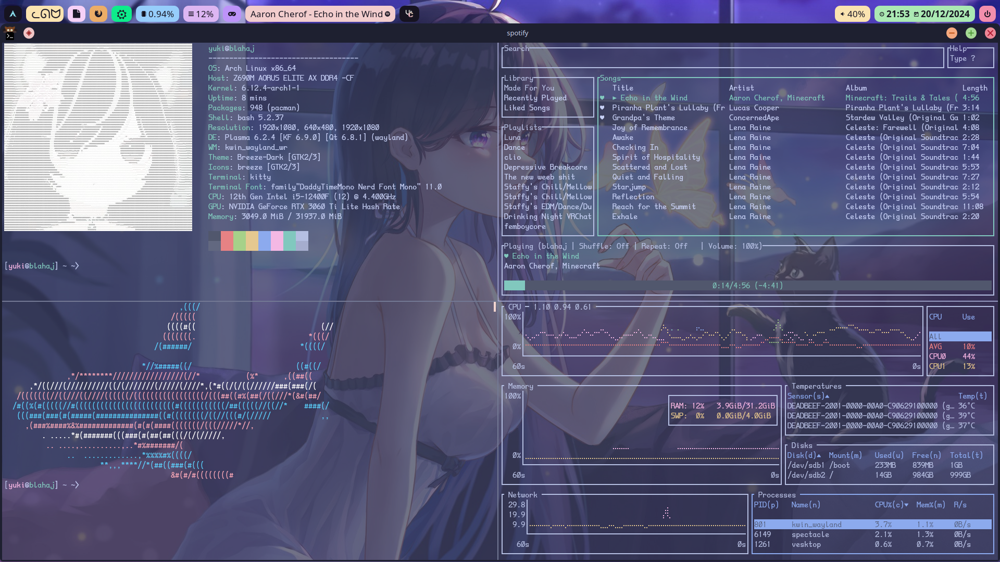

yippeee~! 

Uhm! Why you here im stupid >~>

dm me in discord i guess

my commit messages arent a reflection of myself i promise

i run the script after archinstall, kde isnt in there

wallpaper links are in todo for screen sizes that arent 1980x1080 (19- somthing- i forgot >~> aaaaa)

todo has the resst of the things i did manually- just ask me in discord for specifcs! ill try to remember

"sounds like an iss-ue, not an iss-me"
-arch
